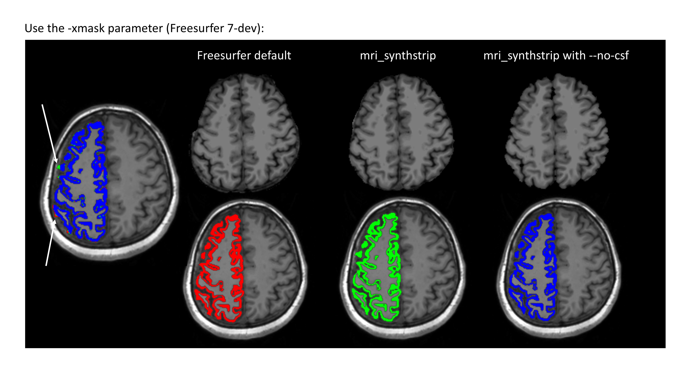
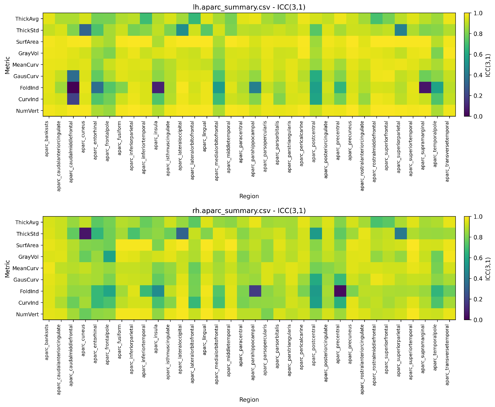
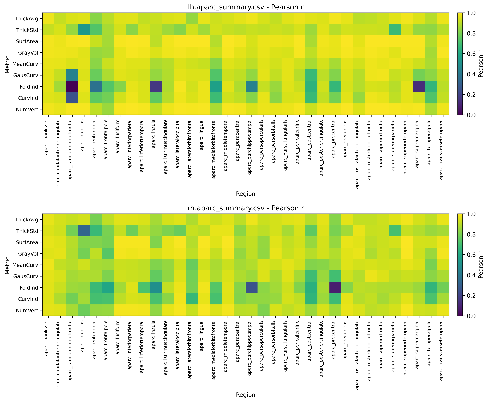
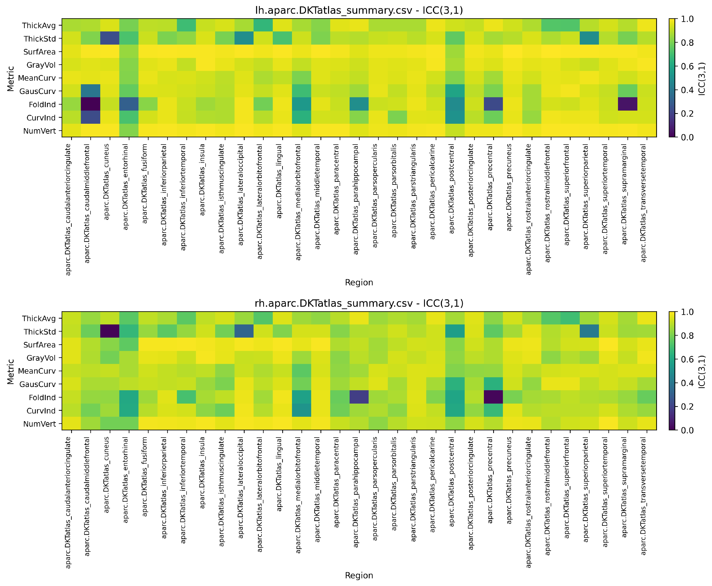
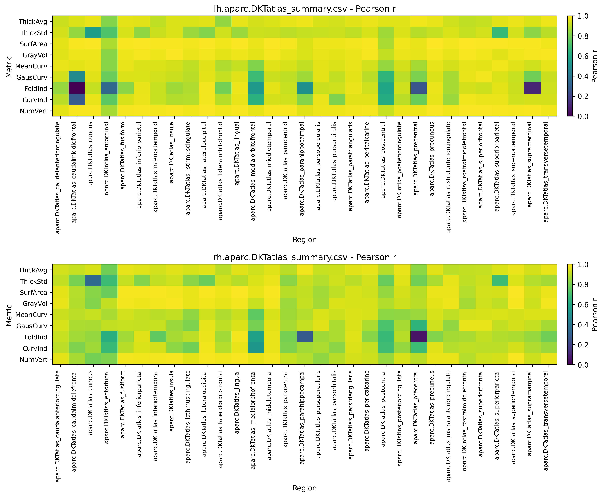
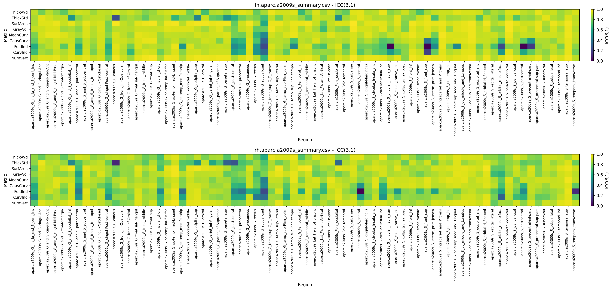
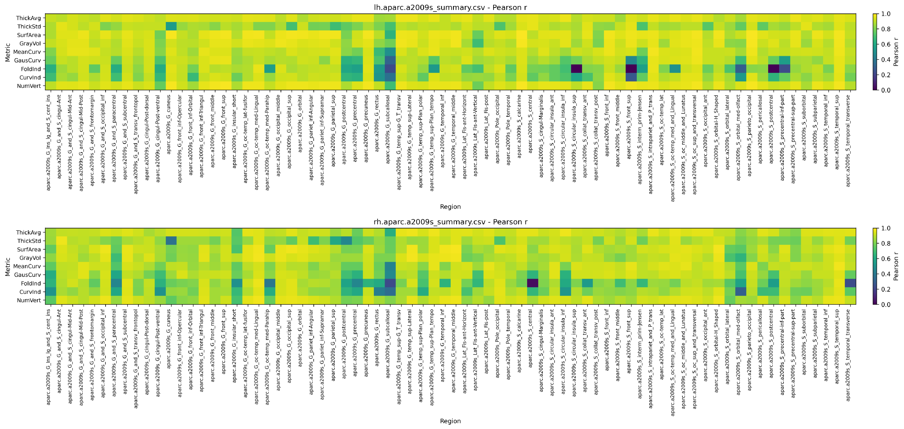

# Freesurfer Pipeline

This page covers the main Freesurfer pipelines. See also:

- **SynthSR** ([synthsr](synthsr.md)): Generate synthetic 1 mm isotropic T1w images from clinical-quality scans.

## Freesurfer recon-all

::: cvdproc.pipelines.smri.freesurfer_pipeline.FreesurferPipeline
    options:
      show_signature: false

----

## A more detailed description:

### Freesurfer: recon-all (standard)

#### Freesurfer Version

The current pipeline uses the Freesurfer 7-dev version (freesurfer-linux-ubuntu22_x86_64-dev-20240909-9ca95c6). Although we prefer using deep learning-based tools implemented in Freesurfer 8 for more accurate and robust processing, the 8 version requires a larger RAM. For our groups with limited computational resources, we opt for the 7-dev version and parallelize the processing of multiple subjects to optimize resource usage.

#### External Brain Mask

We found that the default brainmask generated by Freesurfer may not be optimal for all datasets. Therefore, the pipeline uses the external SynthStrip mask generated by `t1_register` for the same T1w image and passes it to `recon-all` with `-xmask`. If the mask does not exist yet, the Freesurfer pipeline generates it with `mri_synthstrip --no-csf` before starting `recon-all`. The `--no-csf` option avoids misclassifying the CSF as grey matter (see the figure below).

The expected mask is stored under `derivatives/xfm/sub-<subject>/ses-<session>/` and retains the selected T1w acquisition entities, for example `sub-001_ses-baseline_acq-highres_space-T1w_desc-brain_mask.nii.gz`.

We compare the results using the external brain mask (`mri_synthstrip` with `--no-csf`) versus the default Freesurfer brain mask in Freesurfer 7-dev in  n = 111 subjects.

Agreement between the two processing pipelines was evaluated using the intraclass correlation coefficient (ICC(3,1)), and Pearson correlation coefficient. Results are displayed in the figures below (cortical measures from 3 parcellations)

##### DK

##### DKT

##### a2009s

#### qcache

We add the `-qcache` option to the `recon-all` command to generate additional surface-based measures.

#### QC

We use [fsqc](https://github.com/Deep-MI/fsqc) by Deep-MI lab for Freesurfer QC.

#### Subfield Segmentation

The subfield segmentation part includes:

- hippocampus and amygdala
- thalamus
- brainstem
- hypothalamus

#### CSV Outputs

Although Freesurfer provides `aparcstats2table` and `asegstats2table` commands to generate CSV files, we implement our own CSV generation function to have more control over the output format. All `.stats` files are parsed to generate CSV files (also when subregions stats files are available) for cortical and subcortical measures except for `*h.curv.stats`.

### Freesurfer: recon-all-clinical.sh

Some extra preprocessing steps were implemented to achieve output similar to `recon-all`, such as cortical morphology metrics. For detailed information on these steps, please refer to the [source code](https://github.com/LuuuXG/cvdproc/blob/main/cvdproc/pipelines/smri/freesurfer/recon_all_clinical.py).

This pipeline is available as `freesurfer_clinical`. It runs `recon-all-clinical.sh` and includes SynthSR for generating a synthetic 1 mm isotropic T1w output.

## Freesurfer Longitudinal Pipeline

Run with `--pipeline freesurfer_longitudinal`. This pipeline runs FreeSurfer's longitudinal processing stream across multiple sessions.

The `-base` and `-long` stages consume the completed cross-sectional session directories, so the external mask is applied during each preceding `freesurfer` run rather than passed again to the longitudinal commands.

### Parameters

- `subregion_ha`: Whether to segment hippocampus and amygdala subregions (default: `False`).
- `subregion_thalamus`: Whether to segment thalamus subregions (default: `False`).
- `subregion_brainstem`: Whether to segment brainstem subregions (default: `False`).
- `subregion_hypothalamus`: Whether to segment hypothalamus subunits (default: `False`).
- `stats2csv`: Whether to convert stats to CSV (default: `False`).
- `extract_from`: Path to extract results from for population-level summary.

## References

\bibliography
